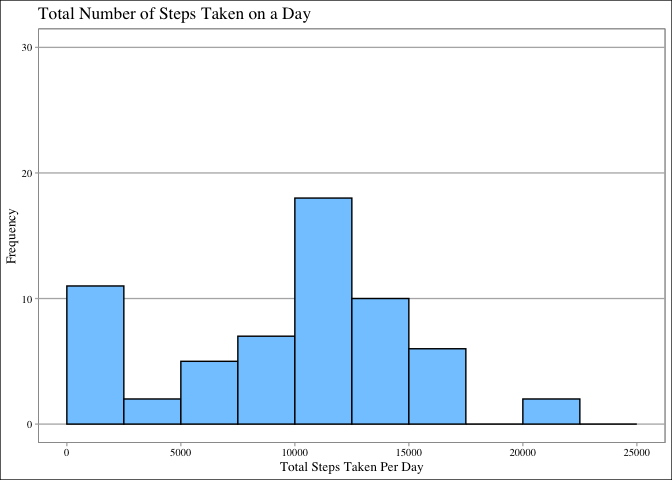
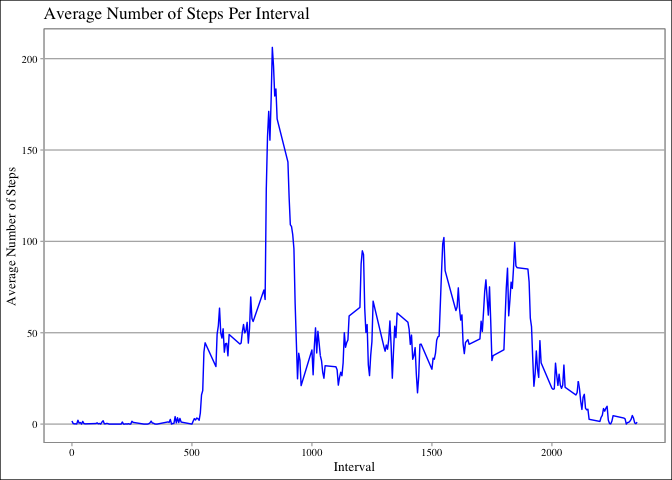
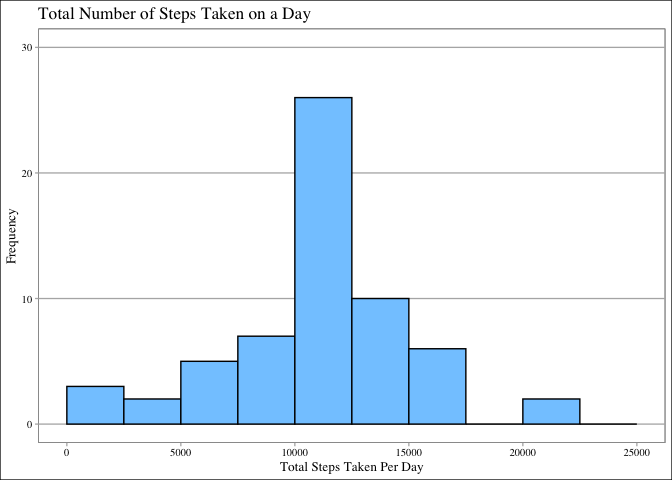
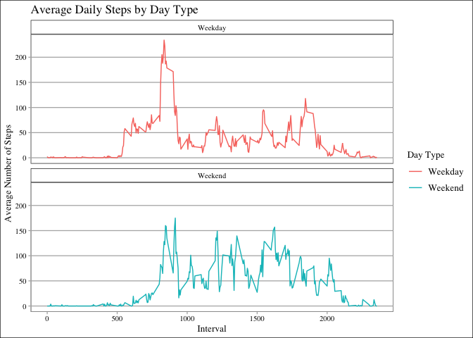

## Loading and preprocessing the data

```r
library(ggplot2)
library(ggthemes)
path = getwd()
unzip("repdata_data_activity.zip", exdir = path)
```

```
## Warning in unzip("repdata_data_activity.zip", exdir = path): error 1 in
## extracting from zip file
```

```r
activity <- read.csv("/Users/idhikajakhetiya/Desktop/R programming/Reproducible R /activity.csv")

activity$date <- as.POSIXct(activity$date, "%Y%m%d")
```

```
## Warning in strptime(xx, f, tz = tz): unknown timezone '%Y%m%d'
```

```
## Warning in as.POSIXct.POSIXlt(x): unknown timezone '%Y%m%d'
```

```
## Warning in strptime(xx, f, tz = tz): unknown timezone '%Y%m%d'
```

```
## Warning in as.POSIXct.POSIXlt(x): unknown timezone '%Y%m%d'
```

```
## Warning in strptime(xx, f, tz = tz): unknown timezone '%Y%m%d'
```

```
## Warning in as.POSIXct.POSIXlt(x): unknown timezone '%Y%m%d'
```

```
## Warning in strptime(xx, f, tz = tz): unknown timezone '%Y%m%d'
```

```
## Warning in as.POSIXct.POSIXlt(x): unknown timezone '%Y%m%d'
```

```
## Warning in strptime(xx, f, tz = tz): unknown timezone '%Y%m%d'
```

```
## Warning in as.POSIXct.POSIXlt(x): unknown timezone '%Y%m%d'
```

```
## Warning in strptime(x, f, tz = tz): unknown timezone '%Y%m%d'
```

```
## Warning in as.POSIXct.POSIXlt(as.POSIXlt(x, tz, ...), tz, ...): unknown
## timezone '%Y%m%d'
```

```r
day <- weekdays(activity$date)
```

```
## Warning in as.POSIXlt.POSIXct(x, tz): unknown timezone '%Y%m%d'
```

```r
activity <- cbind(activity, day)


summary(activity)
```

```
## Warning in as.POSIXlt.POSIXct(x, tz): unknown timezone '%Y%m%d'
```

```
##      steps             date               interval          day           
##  Min.   :  0.00   Min.   :2012-10-01   Min.   :   0.0   Length:17568      
##  1st Qu.:  0.00   1st Qu.:2012-10-16   1st Qu.: 588.8   Class :character  
##  Median :  0.00   Median :2012-10-31   Median :1177.5   Mode  :character  
##  Mean   : 37.38   Mean   :2012-10-31   Mean   :1177.5                     
##  3rd Qu.: 12.00   3rd Qu.:2012-11-15   3rd Qu.:1766.2                     
##  Max.   :806.00   Max.   :2012-11-30   Max.   :2355.0                     
##  NA's   :2304
```

## What is mean total number of steps taken per day?

```r
activityTotalSteps <- with(activity, aggregate(steps, by = list(date), sum, na.rm = TRUE))
```

```
## Warning in as.POSIXlt.POSIXct(x): unknown timezone '%Y%m%d'

## Warning in as.POSIXlt.POSIXct(x): unknown timezone '%Y%m%d'
```

```r
names(activityTotalSteps) <- c("Date", "Steps")

totalStepsdf <- data.frame(activityTotalSteps)


g <- ggplot(totalStepsdf, aes(x = Steps)) + 
  geom_histogram(breaks = seq(0, 25000, by = 2500), fill = "#83CAFF", col = "black") + 
  ylim(0, 30) + 
  xlab("Total Steps Taken Per Day") + 
  ylab("Frequency") + 
  ggtitle("Total Number of Steps Taken on a Day") + 
  theme_calc(base_family = "serif")

print(g)
```

<!-- -->

```r
mean(activityTotalSteps$Steps)
```

```
## [1] 9354.23
```

```r
median(activityTotalSteps$Steps)
```

```
## [1] 10395
```
## What is the average daily activity pattern?

```r
averageDailyActivity <- aggregate(activity$steps, by = list(activity$interval), FUN = mean, na.rm = TRUE)

names(averageDailyActivity) <- c("Interval", "Mean")


averageActivitydf <- data.frame(averageDailyActivity)


da <- ggplot(averageActivitydf, mapping = aes(Interval, Mean)) + 
  geom_line(col = "blue") +
  xlab("Interval") + 
  ylab("Average Number of Steps") + 
  ggtitle("Average Number of Steps Per Interval") +
  theme_calc(base_family = "serif")
  
print(da)
```

<!-- -->

```r
averageDailyActivity[which.max(averageDailyActivity$Mean), ]$Interval
```

```
## [1] 835
```

## Imputing missing values

```r
sum(is.na(activity$steps))
```

```
## [1] 2304
```

```r
imputedSteps <- averageDailyActivity$Mean[match(activity$interval, averageDailyActivity$Interval)]

activityImputed <- transform(activity, steps = ifelse(is.na(activity$steps), yes = imputedSteps, no = activity$steps))


totalActivityImputed <- aggregate(steps ~ date, activityImputed, sum)
```

```
## Warning in as.POSIXlt.POSIXct(x): unknown timezone '%Y%m%d'

## Warning in as.POSIXlt.POSIXct(x): unknown timezone '%Y%m%d'
```

```r
names(totalActivityImputed) <- c("date", "dailySteps")
sum(is.na(totalActivityImputed$dailySteps))
```

```
## [1] 0
```

```r
totalImputedStepsdf <- data.frame(totalActivityImputed)


p <- ggplot(totalImputedStepsdf, aes(x = dailySteps)) + 
  geom_histogram(breaks = seq(0, 25000, by = 2500), fill = "#83CAFF", col = "black") + 
  ylim(0, 30) + 
  xlab("Total Steps Taken Per Day") + 
  ylab("Frequency") + 
  ggtitle("Total Number of Steps Taken on a Day") + 
  theme_calc(base_family = "serif")

print(p)
```

<!-- -->

```r
mean(totalActivityImputed$dailySteps)
```

```
## [1] 10766.19
```

```r
median(totalActivityImputed$dailySteps)
```

```
## [1] 10766.19
```

## Are there differences in activity patterns between weekdays and weekends?

```r
activity$date <- as.Date(strptime(activity$date, format="%Y-%m-%d"))
```

```
## Warning in as.POSIXlt.POSIXct(x): unknown timezone '%Y%m%d'
```

```r
activity$dayType <- sapply(activity$date, function(x) {
  if(weekdays(x) == "Saturday" | weekdays(x) == "Sunday")
  {y <- "Weekend"}
  else {y <- "Weekday"}
  y
})

activityByDay <-  aggregate(steps ~ interval + dayType, activity, mean, na.rm = TRUE)


dayPlot <-  ggplot(activityByDay, aes(x = interval , y = steps, color = dayType)) + 
  geom_line() + ggtitle("Average Daily Steps by Day Type") + 
  xlab("Interval") + 
  ylab("Average Number of Steps") +
  facet_wrap(~dayType, ncol = 1, nrow=2) +
  scale_color_discrete(name = "Day Type") +
  theme_calc(base_family = "serif")

print(dayPlot) 
```

<!-- -->
